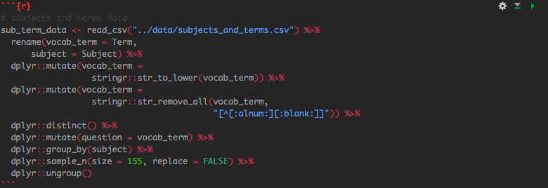

```{r setup, include=FALSE}
knitr::opts_chunk$set(echo = FALSE,
                      message = FALSE, warning=FALSE, error = FALSE)
```


# Overview

## Research question

What are the most important and most difficult school subjects according to Jeopardy?

## Introduction

- Initial data investigation showed subject bias
- Prompted us to consider traditional school subjects
- Decided to compare "Jeopardy-based" education to public school education

## Methods: Joining Quizlet and Jeopardy data

- Created a dataframe of school subjects and related terms (from Quizlet)
- Converted all Jeopardy data and school subject data to lowercase and removed all special characters
- Randomly sampled 155 vocab terms from school subject data 
- Used `inner_join` from the `dplyr` pacakage to match a the "question" to a specific vocab term
- Grouped the "questions" by subject

## Methods: Determining subject importance and difficulty using joined dataframe

- Discovered answer value changes after November 26, 2001 and decided to separate data into two categories
- Calculated number of occurances of each school subject (most important subject)
- Calculated average value of all "answers" for each school subject (most difficult subject)
- Graphed results using interactive heat map faceted by round and date

## Results: Heat map for round 1 and 2


## Results: Daily Double heat map


## Results: Summary statistics before 11/26/2001


## Results: Summary statistics after 11/26/2001


## Conclusion

- AP test scores: Geo, English, History, Science, Math, Art
- Before 11/26/2001: Art, Science, History, English, Math, Geo
- After 11/26/2001: Art, English, History,  Science, Geo, Math

# Tutorial

## Overview: Approach in R
- The data for the subjects which, we would use to filter down the Jeopardy!, questions needed to be created
and cleaned
- Initial Jeopardy! and subject data cleaning steps were taken to make the data  more uniform (lowercase columns and values) removing special characters and numbers to facilitate our joining.  
- The Jeopardy! and subject terms data were then joined, using `inner_join`, by the "question" column to only keep the rows which are in are in Jeopardy! and subjects terms data frames, and `inner_join` returns all columns. 

## Overview: Approach in R
- For the creation of the subject data we had to utilize the `sample_n()` function from `dplyr` since we had more words for some subjects than others, and we chose to randomly select 155 words from each subject. 
- Following our join of the two data frames we had to create one more column to depict the change in value of the question/answers that occurred after November 26, 2001. 

## Packages
* packages for data filtering
  + library(readr)
  + library(dplyr)
  + library(stringr)
* package for tables
  + library(kableExtra)
* packages for plots
  + library(ggplot2)
  + library(viridis)
  + library(forcats)
  + library(plotly)
  + library(ggthemes)
  + library(RColorBrewer)

## Our Code


## Our Code



## Our Code


## Lessons learned

- .Rmd can be a curse and a blessing
  + Getting exactly what you think your .pdf should look like knitted isn't always the easist thing. 
- GitHub is a wonderful tool for collaborative work
  + Be very sure to inform others when you have pushed large amounts of changes...

## References

- Quizlet Inc. (2019). Quizlet. Retrieved from https://quizlet.com/
- R Programming for Research Retrieved from https://geanders.github.io/RProgrammingForResearch/
- Stack Exchange Retrieved from https://stackexchange.com/ 
